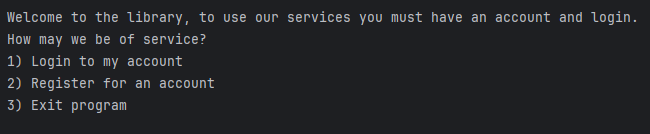

# Library Application

<!-- TOC start (generated with https://github.com/derlin/bitdowntoc) -->

- [Library Application](#library-application)
   * [General outline](#general-outline)
   * [Running this project](#running-this-project)
      + [Local development](#local-development)
   * [Technologies](#technologies)
   * [Credits](#credits)

<!-- TOC end -->

<!-- TOC -->
## General outline

This is library project showcasing User, Book, Library and a Library service entities. The project has the full functionality expected from a library from a user registering, logging in/out, borrow/return a book and admins running reports. All project functionality can be run from the console, all data is persisted using json.

**Feature details** 

- **Users**

Users objects can be made and can register to the library and login after. User objects are stored in the data/users.json and any modifications reflect here. Users can borrow, return and if they are admin run reports from the library software. 

- **Books**

Books can be borrowed, returned and reports can be run against them. 

- **Library**

Within the context of this application the Library is the owner of the rest of the objects. The Library is where Users register and login, Books are added and edited.

- **Library Service**

The Library Service only concerns itself with user interaction. All user interaction will occur in the terminal and the Library Service handles all of this interaction. The Service layer produces prompt user friendly feedback for user input and handles all exceptions gracefully with feedback. 

<!-- TOC -->
## Running this project

The project does not contain a front-end and must be run from an IDE to be used. I would recommend either [Intellij IDEA](https://www.jetbrains.com/idea/) or [VS Code](https://code.visualstudio.com/)

<!-- TOC -->
### Local development

**Quickstart**
To rapidly run this project run these commands and use Java 21, more detailed instructions further below

git clone https://github.com/JamesBracken/library.git

cd library

javac -d out $(find src -name "*.java")

java -cp out com.library.Main

**Cloning**
Clone this repo with bash

git clone https://github.com/JamesBracken/library

**Forking** 
To fork this repository follow [These steps](https://docs.github.com/en/pull-requests/collaborating-with-pull-requests/working-with-forks/fork-a-repo)

<!-- TOC -->
## Technologies

- [Intellij IDEA](https://www.jetbrains.com/idea/) and [VS Code](https://code.visualstudio.com/) ~ Used as my IDE 

- Java ~ The project was made purely with the java programming language

- ChatGPT ~ To aid in development

<!-- TOC -->
## Credits

A big thank you to Nology and my coach Remi Hoeppe, they provided the training and support needed to make this project possible.